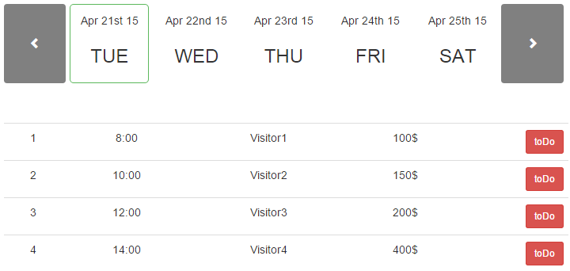

# TIMETABLE PLUGIN v1.0.1

A simple JQuery plugin.

### Installation

##### 1. Copy TIMETABLE PLUGIN files to your app


##### 2. Include script after the jQuery library:
```javascript
<script src="/path/to/timetable.js"><script>
```

##### 3. Add styles to the head section of your webpage
```javascript
<link href="/path/to/timetable.css" rel="stylesheet">
```

##### 4. Initialize plugin

Add simple html to the body of your webpage:
```javascript
<div data-element="timetable"></div>
```

Add initialize script:
```javascript
<script type="text/javascript" language="javascript">
        $(document).ready(function () {
            $('[data-element="timetable"]').timetable();
        });</script>
```

### Requirements


 * "jquery": "2.1.3"
 * "bootstrap": "3.3.2"
 * "underscorejs": "1.8.3"
 * "moment.js": "2.0.0"